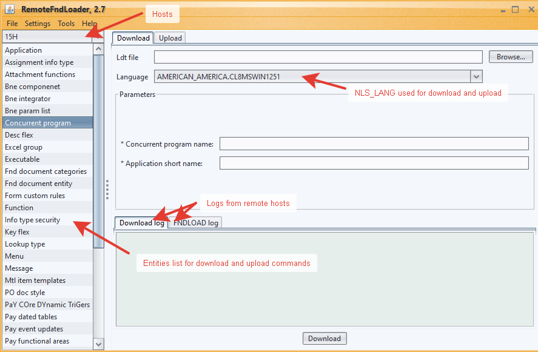

# remotefndloader
This is a FNDLOAD wrapper that has a GUI and  allows to remotely execute FNDLOAD upload and download commands using SSH.

Supports authentication using username/password and SSH private key (including Putty Pageant).

